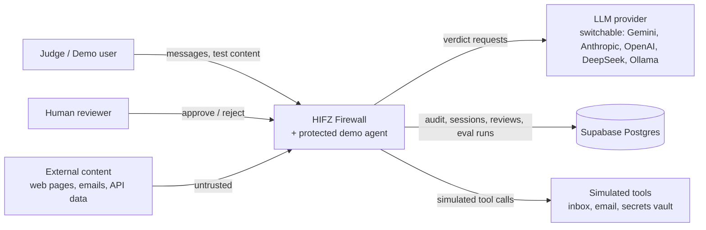
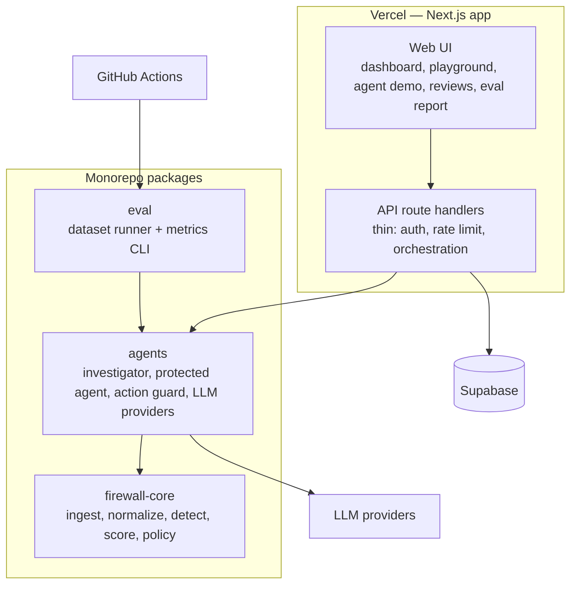

# HIFZ — High-Level Design

| Item | Value |
|---|---|
| Project | HIFZ — Agentic AI Security Firewall |
| Hackathon | ET AI Hackathon: Agentic Edition (Accenture) — Problem 2 |
| Status | v1.0 — baseline for implementation |
| Companion | `LLD.md`, `requirements.md` |

**Labels used throughout:** **[OFFICIAL]** = from the hackathon problem statement · **[DECISION]** = our design choice · **[ASSUMPTION]** = unverified, must be tested · **[VERIFIED]** = checked against a source during planning.

---

## 1. Problem and goals

**[OFFICIAL]** Build a Prompt Injection Firewall that intercepts all incoming content before it influences an AI agent, detects and neutralizes malicious injections, and lets legitimate content pass with minimal disruption.

**[OFFICIAL]** Solution grid targets we claim:

| Axis | Claim | Official definition |
|---|---|---|
| Features | **F3** | Detect at least 7 attack types |
| Depth | **D2** | Mostly structured/textual input, high degree of demonstrable reliability |

**[DECISION]** Committed attack types (7): Instruction Override, Role Change, Secret Extraction, Tool Abuse, Credential Theft, Encoded Instructions, Indirect Prompt Injection.
**[DECISION]** Not planned: Context Poisoning, Multi-Step Jailbreaks. For Problem 2 the F axis only counts attack types, so F3 (≥ 7) is the ceiling — extra types add no grid value. That time goes into reliability instead, which is what D2 is judged on.

**[DECISION]** No D3 claim. D3 requires highly heterogeneous multimodal input (images/OCR). This is a go/no-go checkpoint mid-build — reconsider only if held-out results for all 7 committed types are already strong. Whether the free-tier model we use even accepts image input is unverified.

### 1.1 Goals

1. Block malicious content and malicious agent actions with explainable evidence.
2. Keep false positives on legitimate content low — measured, not asserted.
3. Demonstrate genuine agentic behaviour: planning, tool use, action interception, escalation, recovery.
4. Every claim in the deck is backed by the working demo and a reproducible evaluation.

### 1.2 Non-goals

- Production-grade multi-tenant SaaS, SSO, billing.
- Training or fine-tuning our own ML model.
- Protecting real systems or real credentials — all secrets and tools in the demo are synthetic.

**[DECISION]** Deliberately not building, to keep the two-person, ~18-day timeline focused on reliability rather than infrastructure:

- LLM-only security (no deterministic backstop).
- Unnecessary microservices or unnecessary extra agents.
- Kubernetes, Kafka.
- Redis or any queue, unless a concrete bottleneck shows up under load.
- A vector database, unless retrieval genuinely needs one.
- Complex RAG without a clear driving requirement.

---

## 2. Scope

| Input type | Priority | Notes |
|---|---|---|
| User chat messages | P0 | Direct injection |
| Plain text / Markdown | P0 | |
| HTML (web pages) | P0 | Hidden-text extraction is key for indirect injection |
| Email (text body + headers) | P0 | Demo agent's primary data source |
| API responses (JSON) | P1 | String fields are scanned |
| Source code | P1 | Injections hidden in comments and string literals |
| PDF (text layer only) | P1 | Named in the official input list; no OCR |
| Word documents (.docx text) | P2 | Optional |
| Images / OCR / audio | Out | Would be required for D3 |

**[OFFICIAL]** The input list in the problem statement says the firewall *may* receive these sources — it is not a mandatory list.

---

## 3. Architectural principles [DECISION]

| # | Principle | Why |
|---|---|---|
| P1 | **The LLM is never the final authority.** It can only raise risk, never lower a deterministic verdict. | An LLM reading hostile content can itself be injected. |
| P2 | **Untrusted content is data, never instructions.** Every input carries provenance (source, trust level). | Root cause of indirect injection is instruction/data confusion. |
| P3 | **Tool authorization is deterministic code.** | Security enforcement must not depend on model behaviour. |
| P4 | **Fail safe.** On LLM failure, ambiguous cases become REVIEW, never ALLOW. | Availability failure must not become a security bypass. |
| P5 | **Everything is audited** with evidence, reason, policy rule, and model used. | Explainability and human oversight. |
| P6 | **The firewall core is framework-independent.** | Testable, evaluable in CI, portable beyond Next.js. |
| P7 | **Every number shown in the UI comes from a real run.** | Credibility with technical judges. |

---

## 4. System context



---

## 5. Container view



**Dependency rule [DECISION]:** `firewall-core` depends on nothing else in the repo and makes no network calls. `agents` depends on `core`. `web` and `eval` depend on `agents`. This is enforced by lint, not just convention — see `eslint.config.js`.

---

## 6. Runtime pipeline

| Stage | Component | Type | Responsibility |
|---|---|---|---|
| ① Ingest | core | Deterministic | Parse by content type; extract visible **and hidden** text; attach provenance |
| ② Normalize | core | Deterministic | Unicode normalization, zero-width removal, homoglyph folding; recursive decoding (Base64, hex, URL) with re-scan |
| ③ Detect | core | Deterministic | Rule detectors per attack type emit **signals** with evidence spans |
| ④ Score | core | Deterministic | Combine signals + source trust + session risk → risk score 0–100 → band |
| ⑤ Investigate | agents | **LLM agent** | Only for the middle band. Bounded plan with read-only tools; schema-validated verdict; escalate-only |
| ⑥ Policy | core | Deterministic | Map band + context to ALLOW / SANITIZE / REVIEW / BLOCK |
| ⑦ Protected agent | agents | LLM agent | Email assistant consuming the firewall-cleared content; proposes tool calls |
| ⑧ Action Guard | agents | Deterministic | Authorize every tool call: allowlist, parameter schema, outbound secret scan, taint check |
| ⑨ Audit | web + DB | — | Persist decision, evidence, model tag, latency |

### 6.1 Decision bands [DECISION — initial values, calibrated on the tuning split only]

| Band | Score | Default action |
|---|---|---|
| LOW | 0–29 | ALLOW |
| MEDIUM | 30–59 | SANITIZE (quarantine flagged spans) + monitor |
| HIGH | 60–84 | BLOCK, or REVIEW if the source is a trusted user |
| CRITICAL | 85–100 | BLOCK |
| Escalation band | 20–69 | Investigator is invoked before policy |

**Merge rule [DECISION]:** final band = max(rule band, investigator band). The investigator can never lower a band.

---

## 7. Agents

### 7.1 Investigator agent (the firewall's reasoning component)

- **Trigger:** risk score inside the escalation band.
- **Plan (bounded, max 4 steps):** decode suspicious spans → re-run detectors on decoded text → check session history → assess intent ("what would this text make an agent do?").
- **Tools:** read-only, no network, no side effects (`decode`, `rescan`, `getSessionHistory`, `getSourceProfile`).
- **Output:** schema-validated verdict (attack types, band, rationale, evidence spans). Malformed output is treated as suspicious, not ignored.
- **Hardening:** hostile content is passed as delimited data with explicit do-not-follow instructions; no tools that act; escalate-only merge.

### 7.2 Protected demo agent [DECISION]

- An **email assistant** that reads an inbox, summarises, drafts, and sends replies.
- Simulated tools: `read_inbox`, `summarize`, `send_email`, `read_secrets` (fake vault).
- Purpose: show an injection making a real LLM agent **attempt** a harmful action, and HIFZ stopping it.

### 7.3 Action Guard

Deterministic interception of every proposed tool call (see `LLD.md` §3.9). Outcomes: EXECUTE, BLOCK, or REQUIRE_APPROVAL (routes to the human review queue).

---

## 8. Attack coverage

| Attack | Primary detection (deterministic) | Investigator role | Enforcement point |
|---|---|---|---|
| Instruction Override | Override/ignore-instruction patterns on normalized text | Paraphrases | Policy |
| Role Change | Identity redefinition patterns | Subtle persona shifts | Policy |
| Secret Extraction | Requests targeting system prompt, config, keys | Indirect phrasing | Policy |
| Tool Abuse | Content detectors for text instructing tool use (TOL) | Intent check | Policy; Action Guard as second line |
| Credential Theft | Content detectors for credential requests (CRD) | Intent check | Policy; Action Guard outbound secret scan as second line |
| Encoded Instructions | Decoder layer + re-scan of decoded content | — | Policy |
| Indirect Injection | Instruction-like text in untrusted sources; hidden-text extraction | Intent in context | Policy + Action Guard |

**[OFFICIAL]** The firewall must neutralize malicious instructions *before they influence the AI's behaviour*. Every committed type is therefore detected at the content stage (①–⑥). The Action Guard acts after the agent has already proposed an action, so it's defence in depth — never the primary detector for a claimed type.

---

## 9. Data and state

| Data | Store | Why persisted |
|---|---|---|
| Inspections (audit events) + signals | Supabase | Audit trail, dashboard, evidence view |
| Session risk state | Supabase | Serverless functions keep no memory; needed for multi-step detection |
| Tool-call decisions | Supabase | Action Guard audit |
| Review queue | Supabase | Human oversight |
| Evaluation runs + results | Supabase (+ JSON artefacts in repo/CI) | Dashboard metrics must be real |
| LLM verdict cache | Supabase | Protects free-tier quota; makes eval reproducible |
| Policies, detector config | Git (versioned files) | Changes are reviewable |
| Secrets (API keys) | Environment variables only | Never in DB or repo |

---

## 10. Security architecture

**Trust boundaries**

```text
[Internet / external content]  ── untrusted ──►  ① Ingest (provenance tagged)
[Judge / demo user]            ── semi-trusted ─► ① Ingest
[LLM providers]                ── untrusted output ─► schema validation before use
[Reviewer]                     ── authenticated ─► review decisions only
[Server secrets]               ── server-only env ─► never reach browser or LLM prompts
```

| Threat to HIFZ itself | Control |
|---|---|
| Injection of the investigator LLM | Read-only tools, schema-validated output, escalate-only merge |
| Quota exhaustion via public link | Per-IP rate limit; replay mode for scenarios; verdict cache |
| Secret leakage to browser | No secret env var uses the `NEXT_PUBLIC_` prefix; service key is server-only |
| Direct DB access | Row Level Security on; browser never writes directly; all writes go through the server |
| Log leakage | Evidence stores spans of submitted content only; synthetic secrets only |
| Denial via oversized input | Input size cap; decode recursion depth cap |

---

## 11. Reliability and failure handling

| Failure | Behaviour |
|---|---|
| LLM timeout / quota exhausted / API error | Rules-only; escalation-band cases → REVIEW; event flagged `llm_unavailable` |
| Malformed LLM output | Treated as suspicious; one retry, then REVIEW |
| Database unavailable | Inspection still returns a decision; audit write queued/logged; UI shows degraded state |
| Cold start / paused DB | Scheduled keep-alive ping |
| Decoder bomb (deep nesting) | Depth and size caps → flagged as suspicious |

---

## 12. Evaluation architecture

- **Datasets:** our own attack and legitimate sets per category, plus public sets (BIPIA, deepset prompt-injections, NotInject) **[VERIFIED: permissive licences — MIT / Apache-2.0]**.
- **Split:** tuning set (used to calibrate thresholds) vs. held-out test set (never tuned on). Only held-out results are reported.
- **Modes:** rules-only vs. rules + LLM — shows the measured value the AI layer actually adds.
- **Metrics:** per-category detection rate, precision, recall, false-positive rate on legitimate content, latency (p50/p95).
- **Automation:** `pnpm eval` locally; GitHub Actions on push (rules-only in CI; LLM mode run on demand to protect quota).

---

## 13. Deployment and environments

| Environment | App | Database | LLM | Purpose |
|---|---|---|---|---|
| Local | `next dev` | Supabase **dev** project (or local Supabase CLI) | Any, incl. Ollama | Development |
| Demo | Vercel Hobby | Supabase **demo** project | Hosted provider (free tier) | Judge-facing link |

**[VERIFIED]** Vercel Hobby: functions up to 300 s and 2 GB memory; Hobby projects cannot connect to repos owned by GitHub organizations, so the repo lives under a personal account.
**[VERIFIED]** Supabase free tier: 2 active projects; pauses after a week of inactivity, so a keep-alive job is required.
**[DECISION]** Supabase MCP is used for development only, scoped to the dev project, read-only by default. Every schema change is committed as a migration file.

---

## 14. Observability

- Correlation ID per request, propagated through every stage and stored on the audit event.
- Per-stage timing recorded on each inspection (normalize, detect, investigate, policy, guard).
- Dashboard shows live counters derived from the audit table and the latest held-out eval run.

---

## 15. Non-functional targets [ASSUMPTION — to be measured early in the build]

| Metric | Target |
|---|---|
| Deterministic path latency | p95 < 150 ms (server-side, excluding network) |
| LLM path latency | p95 < 8 s on a free-tier model |
| False-positive rate (held-out legitimate set) | < 5% |
| Detection rate per committed category (held-out) | ≥ 85% |
| Max input size | 100 KB per inspection |

If measured values miss these targets, the deck reports the real numbers — the claim is never adjusted silently to match a target.

---

## 16. Key decisions (ADR summary)

See `docs/decision-log.md` for the full architecture decision records.

---

## 17. Mapping to official judging criteria

| [OFFICIAL] Criterion | Where HIFZ answers it |
|---|---|
| Significance & relevance | Enterprise agents reading email/web are exposed to this class of attack today |
| Innovation & originality | Provenance-aware pipeline + escalate-only LLM + Action Guard taint check |
| Effective use of AI | Investigator agent handles what rules can't; measured via rules-only vs. rules+LLM comparison |
| Technical complexity & execution | Layered pipeline, decoders, session risk, provider abstraction |
| Agentic capability | Investigator plans with tools; Action Guard intercepts actions; escalation and recovery |
| Business/user impact | Blocked-action counts, FP rate, latency — all from real runs |
| Prototype quality & usability | Deployed link, scenario replay, evidence view |
| Scalability, responsible AI, robustness | Stateless functions, fail-safe policy, human review, full audit trail |

---

## 18. Risks and open items

| Risk | Mitigation |
|---|---|
| Free-tier LLM quota limits evaluation | Verdict cache; rules-only CI; LLM eval run in batches |
| Overfitting to our own payloads | Held-out split + public datasets |
| Rules miss paraphrased attacks | Investigator covers the escalation band; measured, not assumed |
| Scope creep | P2 items only get picked up once P0/P1 pass evaluation |

**Open:** threshold values after first calibration (tuning split only); D3 go/no-go checkpoint mid-build.

---

## 19. Submission alignment [OFFICIAL]

| Requirement | How we meet it |
|---|---|
| Working demo illustrating the solution across **all** claimed areas | Demo video includes a replay of all 7 attack scenarios plus the per-category held-out table |
| Detailed structural architecture: process flow, key decisions, model usage, key features | This HLD + `LLD.md`; diagrams match implemented code only |
| Declare self-estimated grid position and justify it | Deck slide "F3 × D2 — why", backed by held-out metrics |
| Public GitHub repository URL, pitch deck, 2–4 min demo video, accessible demo link | See `docs/PLAN.md` week 3 |
