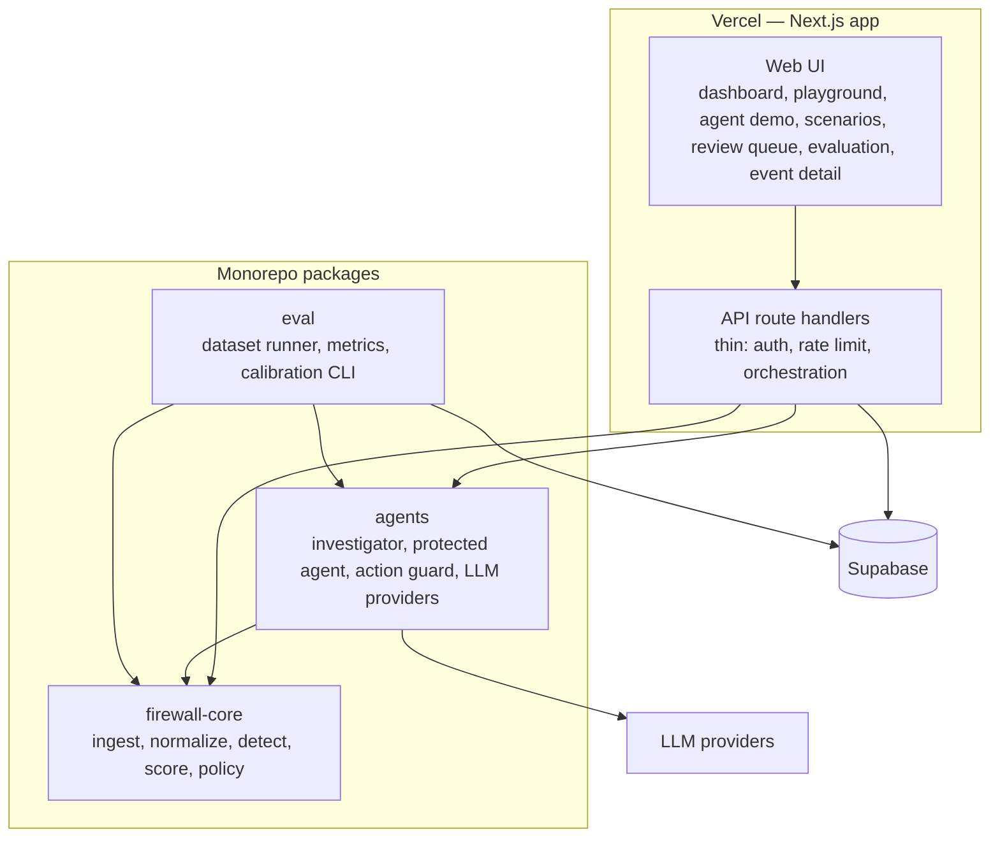
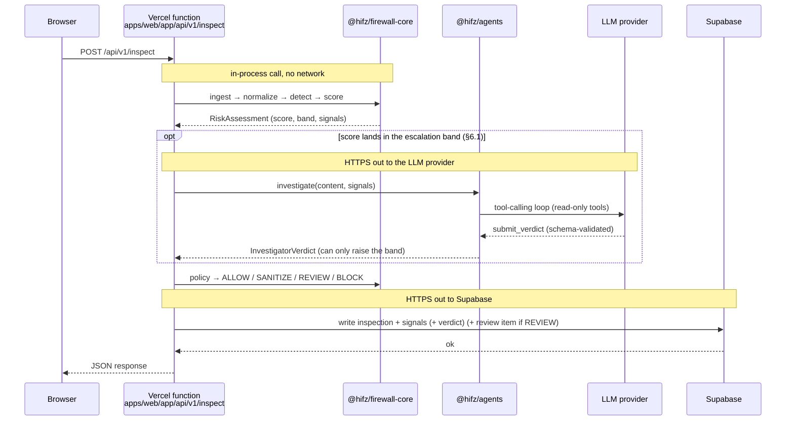
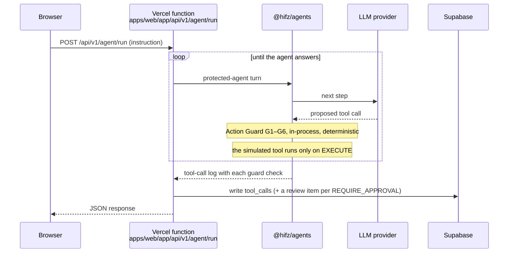

# HIFZ AI — High-Level Design

| Item | Value |
|---|---|
| Project | HIFZ AI — Agentic Security Firewall |
| Team | Umar Farook M — lead, J Rasool Sheerin Sidhara |
| Hackathon | ET AI Hackathon: Agentic Edition (Accenture) — Problem 2 |
| Status | v1.1 — brought in line with the implementation on 2026-10-01 (PLAN 3.6); diagrams describe built components only |
| Companion | `LLD.md`, `requirements.md` |

**Labels used throughout:** **[OFFICIAL]** = from the hackathon problem statement · **[DECISION]** = our design choice · **[ASSUMPTION]** = unverified, must be tested · **[VERIFIED]** = checked against a source during planning.

---

## 1. Problem and goals

**[OFFICIAL]** Build a Prompt Injection Firewall that intercepts all incoming content before it influences an AI agent, detects and neutralizes malicious injections, and lets legitimate content pass with minimal disruption.

**[OFFICIAL]** Solution grid targets we claim:

| Axis | Claim | Official definition |
|---|---|---|
| Features | **F3** | Detect at least 7 attack types |
| Depth | **D2** | Mostly structured/textual input, high degree of demonstrable reliability |

**[DECISION]** Committed attack types (7): Instruction Override, Role Change, Secret Extraction, Tool Abuse, Credential Theft, Encoded Instructions, Indirect Prompt Injection.
**[DECISION]** Not planned: Context Poisoning, Multi-Step Jailbreaks. For Problem 2 the F axis only counts attack types, so F3 (≥ 7) is the ceiling — extra types add no grid value. That time goes into reliability instead, which is what D2 is judged on.

**[DECISION]** No D3 claim. D3 requires highly heterogeneous multimodal input (images/OCR). This is a go/no-go checkpoint mid-build — reconsider only if held-out results for all 7 committed types are already strong. Whether the free-tier model we use even accepts image input is unverified.

### 1.1 Goals

1. Block malicious content and malicious agent actions with explainable evidence.
2. Keep false positives on legitimate content low — measured, not asserted.
3. Demonstrate genuine agentic behaviour: planning, tool use, action interception, escalation, recovery.
4. Every claim in the deck is backed by the working demo and a reproducible evaluation.

### 1.2 Non-goals

- Production-grade multi-tenant SaaS, SSO, billing.
- Training or fine-tuning our own ML model.
- Protecting real systems or real credentials — all secrets and tools in the demo are synthetic.

**[DECISION]** Deliberately not building, to keep the two-person, ~18-day timeline focused on reliability rather than infrastructure:

- LLM-only security (no deterministic backstop).
- Unnecessary microservices or unnecessary extra agents.
- Kubernetes, Kafka.
- Redis or any queue, unless a concrete bottleneck shows up under load.
- A vector database, unless retrieval genuinely needs one.
- Complex RAG without a clear driving requirement.

---

## 2. Scope

| Input type | Priority | Notes |
|---|---|---|
| User chat messages | P0 | Direct injection |
| Plain text / Markdown | P0 | |
| HTML (web pages) | P0 | Hidden-text extraction is key for indirect injection |
| Email (text body + headers) | P0 | Demo agent's primary data source |
| API responses (JSON) | P1 | String fields are scanned |
| Source code | P1 | Injections hidden in comments and string literals |
| PDF (text layer only) | P1 | Named in the official input list; no OCR |
| Word documents (.docx) | Out | Not built. `docx` is a reserved value in the API and database enums; the API answers 400 ("no ingest adapter") |
| Images / OCR / audio | Out | Would be required for D3 |

**[OFFICIAL]** The input list in the problem statement says the firewall *may* receive these sources — it is not a mandatory list.

---

## 3. Architectural principles [DECISION]

| # | Principle | Why |
|---|---|---|
| P1 | **The LLM is never the final authority.** It can only raise risk, never lower a deterministic verdict. | An LLM reading hostile content can itself be injected. |
| P2 | **Untrusted content is data, never instructions.** Every input carries provenance (source, trust level). | Root cause of indirect injection is instruction/data confusion. |
| P3 | **Tool authorization is deterministic code.** | Security enforcement must not depend on model behaviour. |
| P4 | **Fail safe.** On LLM failure, ambiguous cases become REVIEW, never ALLOW. | Availability failure must not become a security bypass. |
| P5 | **Everything is audited** with evidence, reason, policy rule, and model used. | Explainability and human oversight. |
| P6 | **The firewall core is framework-independent.** | Testable, evaluable in CI, portable beyond Next.js. |
| P7 | **Every number shown in the UI comes from a real run.** | Credibility with technical judges. |

### 3.1 Technology stack rationale [DECISION — ADR-2, ADR-6, ADR-11]

The most common question this stack gets: *why not Angular + Spring Boot, a dedicated database, and AWS?* Short answer — none of those are wrong choices in general, they're just optimized for a different situation (a larger team, a longer timeline, or an existing ops budget) than a two-person team shipping a working, reliable prototype in about 18 days at $0. Each row below is a real tradeoff we made deliberately, not a default.

**Frontend + backend framework**

| | Our choice: TypeScript + Next.js | Alternative: Angular + Spring Boot |
|---|---|---|
| Languages to get right | One (TypeScript), shared types across UI, API, and the firewall packages | Two (TypeScript + Java), with DTOs hand-duplicated and kept in sync between them |
| Deploy shape | UI and API routes are one build, one deploy (§5.1) | Two separate services, two build pipelines, two things that can fall out of sync before a demo |
| Cold start / footprint | Serverless functions start in milliseconds | A JVM process is heavy to start; keeping it warm on a free tier means an always-on instance, which costs money we don't have |
| Team fit | React/Next.js was the lower ramp-up cost for the team member newer to the stack (see the risk note in `docs/architecture/HLD.md` §18) | Angular's module/DI/RxJS model is more ceremony to learn under time pressure |
| LLM tooling maturity | The JS/TS ecosystem has first-class SDKs for every provider we support (Gemini, Anthropic, OpenAI, DeepSeek, Ollama) | Java LLM tooling exists but is less mature and less documented — more time spent on plumbing, less on the actual detection logic that's being judged |

**Database**

| | Our choice: Supabase Postgres | Alternative: a self-managed/dedicated Postgres (e.g. AWS RDS, or Postgres on a VM) |
|---|---|---|
| What you get out of the box | Managed Postgres + an auto-generated REST API (PostgREST) + Auth (used directly for reviewer login, ADR-9) + a Studio UI for inspecting data live during the demo | Just a database — auth, an API layer, and an admin UI are all separate things we'd have to build or bolt on |
| Serverless connection handling | Built for exactly this pattern (many short-lived serverless invocations) via PostgREST/pooling | A traditional Postgres connection limit is easy to exhaust from serverless functions opening/closing connections rapidly — needs its own pooler (e.g. RDS Proxy) to do safely |
| Setup time | One CLI command per project, working in under a minute (PLAN task 1.4) | VPC, security groups, subnet routing, and a pooler to expose it safely to a serverless frontend |
| Cost durability | Free tier with known, documented limits we've already planned around (500 MB storage, pauses after a week idle — kept active by a daily Vercel Cron ping, §13) | RDS's free tier is time-limited (12 months on a new AWS account), then billed — a cost risk for a project with no budget |
| Underlying tech | It's still just Postgres — no proprietary lock-in beyond Auth/RLS, which are themselves just Postgres extensions and a thin auth service | — |

**Hosting / deployment**

| | Our choice: Vercel | Alternative: AWS (EC2 / ECS / Lambda + API Gateway) |
|---|---|---|
| Setup to get to "deployed" | `git push` → built, HTTPS, CDN, preview URL per commit, done (PLAN task 1.3, §5.1) | IAM roles, VPC, API Gateway/ECS task definitions, CloudFront, ACM certs, Route 53 — real infrastructure work before the first request is served |
| Time tradeoff | Near-zero infra time, more time on detectors/agents/eval — the things actually being judged | Infra setup time for a 2-person, ~18-day build directly competes with build time for the parts of the solution graders score |
| Cost risk during a hackathon | Hobby tier is free with clear, fixed limits | Easy to accidentally leave something billable running (an idle EC2 instance, a NAT gateway) — a real risk for a team without day-to-day AWS cost-management habits |
| Fit for the framework | Vercel is built by the Next.js team specifically for this framework — zero-config serverless functions per API route | Would need to hand-wire the same serverless-per-route behaviour ourselves |

**This isn't a one-way door.** `firewall-core` has zero framework dependency (P6) and the database is plain Postgres with versioned migrations, not a Supabase-proprietary schema — so moving to a Spring Boot service and a self-managed Postgres instance on AWS later, if this ever became a real product with a larger team and ops budget, would be a contained migration of the API and hosting layer, not a rewrite of the security logic itself.

---

## 4. System context


---

## 5. Container view



**Dependency rule [DECISION]:** `firewall-core` depends on nothing else in the repo and makes no network calls. `agents` depends on `core`. `web` and `eval` depend on both `agents` and `core` (the API runs the deterministic pipeline in-process). Continuous integration is a manual GitHub Actions run of lint, typecheck and unit tests (§12); it does not run the evaluation. This is enforced by lint, not just convention — see `eslint.config.js`.

### 5.1 Why one deployable app, not separate frontend/backend services [DECISION — ADR-10]

There is exactly **one deployable artifact**: `apps/web`, a Next.js app. It is not a frontend that calls out to a separately hosted backend. Next.js's App Router lets one app contain both UI pages (`app/**/page.tsx`) and server-side API route handlers (`app/api/**/route.ts`) side by side. On Vercel, each API route becomes its own serverless function. Deploying "the web app" *is* deploying the backend — they are the same build.

`packages/agents` and `packages/firewall-core` are **plain libraries with no server of their own** — they only run when an API route imports and calls them, inside that route's serverless function, for the lifetime of a single request. There is no standing "agent process," no queue, no worker pool.

**Request flow 1 — `POST /api/v1/inspect` (the firewall):**



**Request flow 2 — `POST /api/v1/agent/run` (the protected agent and the Action Guard):**



The Action Guard is part of flow 2 only: `/inspect` inspects *content*, and `/agent/run` is where an agent proposes *actions*. Everything in each flow happens inside one function invocation: it starts when the request comes in and ends when the response is sent. Nothing is left running in the background afterward; the network hops out (LLM provider, Supabase) are the only times a function talks to anything outside itself.

**Why [DECISION]:**

| Reason | Detail |
|---|---|
| Matches the non-goals in §1.2 | No Kubernetes, no Kafka, no Redis, no dedicated agent server to provision, patch, or pay for. |
| Fits the free-tier hosting constraint | Vercel Hobby only hosts serverless/edge functions, not long-running processes — a persistent agent server wouldn't fit this deployment target at all (§13). |
| Forces principle P6 (§3) | Keeping `firewall-core` and `agents` as plain libraries with no server means they're portable, unit-testable in CI, and reusable from `packages/eval`'s CLI runner without spinning up HTTP infrastructure. |
| Consistent with P4 (fail-safe) and reliability model (§11) | Serverless functions keep no memory between requests, so anything that must persist — session risk, the LLM verdict cache, the review queue — lives in Supabase, not in-process. **[ASSUMPTION]** Rate-limit counters are the exception: they are in memory per serverless instance, a best-effort control rather than a global one (a shared store would fix this). A separate backend server wouldn't remove that requirement; it would just add a second place state could go missing. |
| One deploy target, one thing to keep warm | Simpler operationally for a two-person team on a hackathon timeline: one Vercel project, one set of env vars, one build to debug. |

**Rejected alternative:** a separately hosted agent/API service (e.g. a small Node server on Render/Fly, called by the Next.js app). Rejected because it would need its own always-on hosting (conflicts with the $0 constraint and the "no unnecessary microservices" principle in CLAUDE.md), introduces a second deployment pipeline and a second place secrets can leak, and buys nothing the serverless model doesn't already provide for this project's traffic shape (low-volume hackathon demo, not a high-throughput production workload).

---

## 6. Runtime pipeline

| Stage | Component | Type | Responsibility |
|---|---|---|---|
| ① Ingest | core | Deterministic | Parse by content type; extract visible **and hidden** text; attach provenance |
| ② Normalize | core | Deterministic | Unicode normalization, zero-width removal, homoglyph folding; recursive decoding (Base64, hex, URL, HTML entities; depth and size capped) with re-scan |
| ③ Detect | core | Deterministic | Rule detectors per attack type emit **signals** with evidence spans |
| ④ Score | core | Deterministic | Combine signals + source trust + session risk → risk score 0–100 → band |
| ⑤ Investigate | agents | **LLM agent** | Only for the middle band. Bounded plan with read-only tools; schema-validated verdict; escalate-only |
| ⑥ Policy | core | Deterministic | Map band, source trust and LLM status to ALLOW / SANITIZE / REVIEW / BLOCK; a REVIEW creates a review-queue item |
| ⑦ Protected agent | agents | LLM agent | Email assistant over a seeded inbox. Each email is scored in memory and delimiter-wrapped as data; its band taints later tool calls (G5). Proposes tool calls. The firewall does not block the emails themselves |
| ⑧ Action Guard | agents | Deterministic | Authorize every tool call: tool allowlist, parameter schema, destination allowlist, outbound secret scan, taint check, per-session rate limit |
| ⑨ Audit | web + DB | — | Persist decision, evidence, model tag, latency, and the review item when one is created |

### 6.1 Decision bands [DECISION — initial values, calibrated on the tuning split only]

| Band | Score | Default action |
|---|---|---|
| LOW | 0–29 | ALLOW |
| MEDIUM | 30–59 | SANITIZE (redact flagged spans, re-scan the result) |
| HIGH | 60–84 | BLOCK for untrusted sources; REVIEW for semi-trusted ones (direct user messages). No source is currently classed as fully trusted |
| CRITICAL | 85–100 | BLOCK |
| Escalation band | 20–69 | Investigator is invoked before policy |

**Merge rule [DECISION]:** final band = max(rule band, investigator band). The investigator can never lower a band.

**Fail-safe precedence [DECISION]:** if the investigator did not weigh in (unavailable, invalid output, or not configured) for a case in the escalation band whose *rule* band is already MEDIUM or higher, the policy returns REVIEW (BLOCK if `LLM_FAILURE_MODE=block`) before any band-based rule. A case whose rule band is LOW (score 20–29) falls through to the normal policy.

---

## 7. Agents

### 7.1 Investigator agent (the firewall's reasoning component)

- **Trigger:** risk score inside the escalation band.
- **Plan (bounded, max 4 steps):** decode suspicious spans → re-run detectors on decoded text → check session history → assess intent ("what would this text make an agent do?").
- **Tools:** read-only, no network, no side effects (`decode`, `rescan`, `getSessionHistory`, `getSourceProfile`).
- **Output:** schema-validated verdict (attack types, band, rationale, evidence spans). Malformed output is treated as suspicious, not ignored. Models miscount characters, so evidence offsets are re-anchored by locating each span's excerpt in the content and unlocatable spans are dropped; the schema check is unchanged and the band can still only be raised.
- **Hardening:** hostile content is passed as delimited data with explicit do-not-follow instructions; no tools that act; escalate-only merge.

### 7.2 Protected demo agent [DECISION]

- An **email assistant** over a seeded inbox: it reads, summarises, and sends email.
- Simulated tools: `read_inbox`, `summarize`, `send_email`, `read_secrets` (fake vault).
- Purpose: show the Action Guard stopping consequential actions an agent proposes. **[VERIFIED]** The live model resists email injection on its own (its system prompt treats email as data; 9 of 9 attempts), so the live demo exercises the guard with user-driven prompts (an outside recipient, a secret, a send after reading the inbox); see `docs/demo-script.md`. The deterministic proof that the guard stops a *manipulated* agent is the scripted tests in `packages/agents/src/protected-agent/`.

### 7.3 Action Guard

Deterministic interception of every proposed tool call (see `LLD.md` §3.9). Outcomes: EXECUTE, BLOCK, or REQUIRE_APPROVAL (creates an item in the human review queue, §7.4).

### 7.4 Human review queue [DECISION]

- **Created by** a REVIEW decision (content) or a REQUIRE_APPROVAL guard outcome (tool call). BLOCK is final and creates no item.
- **States:** PENDING → APPROVED or REJECTED. An item nobody decides within 15 minutes is EXPIRED and counts as rejected (fail-safe). EXPIRED is derived when the queue is read; there is no background job.
- **Access:** reading the queue is public (demo data only, like the audit log). Deciding requires an authenticated reviewer: a Supabase Auth account whose role is stored in server-controlled `app_metadata` (writable only with the service key), checked on every decision. A decision is a single conditional update, so two reviewers racing, or a late click, cannot both succeed.
- **Effect:** approving a held tool call releases a *simulated* tool; the original `tool_calls` row is never rewritten. Details: `LLD.md` §3.11.

---

## 8. Attack coverage

| Attack | Primary detection (deterministic) | Investigator role | Enforcement point |
|---|---|---|---|
| Instruction Override | Override/ignore-instruction patterns on normalized text | Paraphrases | Policy |
| Role Change | Identity redefinition patterns | Subtle persona shifts | Policy |
| Secret Extraction | Requests targeting system prompt, config, keys | Indirect phrasing | Policy |
| Tool Abuse | Content detectors for text instructing tool use (TOL) | Intent check | Policy; Action Guard as second line |
| Credential Theft | Content detectors for credential requests (CRD) | Intent check | Policy; Action Guard outbound secret scan as second line |
| Encoded Instructions | Decoder layer + re-scan of decoded content | — | Policy |
| Indirect Injection | Instruction-like text in untrusted sources; hidden-text extraction | Intent in context | Policy + Action Guard |

The detector set (version `detectors-v2`) and every calibration change are recorded in `docs/calibration-log.md`; `policies/detectors.yaml` is a hand-maintained reference mirror of the rules in `packages/firewall-core/src/detect/rules/`.

**[OFFICIAL]** The firewall must neutralize malicious instructions *before they influence the AI's behaviour*. Every committed type is therefore detected at the content stage (①–⑥). The Action Guard acts after the agent has already proposed an action, so it's defence in depth — never the primary detector for a claimed type.

---

## 9. Data and state

| Data | Store | Why persisted |
|---|---|---|
| Inspections (audit events) + signals + LLM verdicts | Supabase | Audit trail, evidence view, live counters; inspections are deleted after 30 days by a scheduled job |
| Session risk state | Supabase | Serverless functions keep no memory; needed for multi-step detection |
| Tool-call decisions | Supabase | Action Guard audit, including each check's result and the triggering emails |
| Review queue | Supabase | Human oversight (§7.4); items expire after 15 minutes |
| Evaluation runs + results | Supabase (+ JSON artefacts in repo/CI) | Evaluation page metrics must be real |
| LLM verdict cache | Supabase | Protects free-tier quota; makes eval reproducible |
| Policies, detector rules | Git: implemented in code (`firewall-core`, `agents`) and mirrored by hand in `policies/*.yaml`, which nothing loads at runtime | Changes are reviewable; the code is the source of truth |
| Secrets (API keys) | Environment variables only | Never in DB or repo |

---

## 10. Security architecture

**Trust boundaries**

```text
[Internet / external content]  ── untrusted ──►  ① Ingest (provenance tagged)
[Judge / demo user]            ── semi-trusted ─► ① Ingest
[LLM providers]                ── untrusted output ─► schema validation before use
[Reviewer]                     ── authenticated, role server-checked ─► review decisions only
[Server secrets]               ── server-only env ─► never reach browser or LLM prompts
```

| Threat to HIFZ itself | Control |
|---|---|
| Injection of the investigator LLM | Read-only tools, schema-validated output, escalate-only merge |
| Quota exhaustion via public link | Per-IP, per-instance in-memory rate limit (`/agent/run` 3/min, others 10/min); verdict cache; scenario replay runs live and is rate-limited like `/inspect` |
| Unauthorized review decisions | Supabase Auth token verified server-side, role in `app_metadata` (writable only with the service key, so self-registration never grants it); public sign-ups disabled; reviewer login shared privately |
| Secret leakage to browser | No secret env var uses the `NEXT_PUBLIC_` prefix; service key is server-only |
| Direct DB access | Row Level Security on; the browser has no write access and no access to `reviews`, `sessions` or the LLM tables; all writes go through the server. (A gap that let any signed-in user update `reviews` was found and closed on 2026-10-01; see `LLD.md` §5.) |
| Log leakage | Evidence stores spans of submitted content only; synthetic secrets only |
| Denial via oversized input | 100 KB input cap (HTTP 413); decode recursion depth and size caps |

---

## 11. Reliability and failure handling

| Failure | Behaviour |
|---|---|
| LLM timeout / quota exhausted / API error / invalid output (after one retry) | Investigator status `unavailable` or `invalid_output`. If the rule band is already ≥ MEDIUM the case becomes REVIEW (BLOCK if `LLM_FAILURE_MODE=block`); a LOW rule band falls through to the normal policy. Recorded as `llm_status` |
| LLM misconfigured (missing API key or model id) | Treated as the `none` provider (the same fail-safe), logged once per role; `GET /health` reports the role as `misconfigured` and the overall status as `degraded`; the Agent demo returns 503 |
| Database unavailable | `/inspect` returns 503: audit is required, so no unaudited decision is issued. `GET /health` reports `db: down` and returns HTTP 503 |
| Cold start / paused DB | A Vercel Cron job (`apps/web/vercel.json`) calls `GET /api/v1/health` once a day. The health check is a read-only database query, so it keeps the free-tier project active without writing anything. If the database is down the call returns 503 and the cron run shows as failed. **[ASSUMPTION]** Supabase counts an API read as activity; that cannot be confirmed without waiting out the pause window |
| Review item left undecided | Expires after 15 minutes and counts as rejected |
| Decoder bomb (deep nesting) | Depth and size caps → flagged as suspicious |

---

## 12. Evaluation architecture

- **Datasets:** our own attack and legitimate sets per category, plus public sets (BIPIA, deepset prompt-injections, NotInject) **[VERIFIED: permissive licences — MIT / Apache-2.0]**.
- **Split:** tuning set (used to calibrate thresholds) vs. held-out test set (never tuned on). Only held-out results are reported.
- **Modes:** rules-only vs. rules + LLM — shows the measured value the AI layer actually adds.
- **Metrics:** per-category detection rate, precision, recall, false-positive rate on legitimate content, latency (p50/p95).
- **Automation:** `pnpm eval` runs locally in either mode and records results to Supabase (`eval_runs`, `eval_results`) and, for the held-out runs, to `docs/eval-results/`. GitHub Actions (manual trigger) runs lint, typecheck and unit tests only; it does not run the evaluation. In `rules_llm` mode the eval throttles model requests to stay under a free-tier requests-per-minute cap and reports any case where the LLM failed.

---

## 13. Deployment and environments

| Environment | App | Database | LLM | Purpose |
|---|---|---|---|---|
| Local | `next dev` | Supabase **dev** project (or local Supabase CLI) | Any, incl. Ollama | Development |
| Demo | Vercel Hobby | Supabase **demo** project | DeepSeek (`deepseek-flash`, pay-as-you-go); Gemini free tier also supported. Ollama is refused when `APP_ENV=demo` | Judge-facing link |

**[VERIFIED]** Vercel Hobby: functions up to 300 s and 2 GB memory; Hobby projects cannot connect to repos owned by GitHub organizations, so the repo lives under a personal account.
**[VERIFIED]** Supabase free tier: 2 active projects; pauses after a week of inactivity, so a daily Vercel Cron ping to `/api/v1/health` keeps it active. **[VERIFIED]** Vercel Hobby cron jobs run at most once per day, at any time within the scheduled hour, in UTC, and only on production deployments.
**[DECISION]** Supabase MCP is used for development only, scoped to the dev project, read-only by default. Every schema change is committed as a migration file.

---

## 14. Observability

- Correlation ID per request, propagated through every stage and stored on the audit event.
- Per-stage timing recorded on each inspection (ingest, normalize, detect, score, investigate).
- The Dashboard shows live counters, the risk-band distribution, the latest events and the latest held-out result, all derived from the audit table and the recorded eval runs (`GET /metrics`, `GET /events`, `GET /reviews`). The Evaluation page shows the full per-category report for each split and mode. `GET /health` reports the app, the database and each LLM role.

---

## 15. Non-functional targets

| Metric | Target | Status |
|---|---|---|
| Deterministic path latency | p95 < 150 ms (server-side, excluding network) | **[VERIFIED]** p95 = 0.063 ms (`docs/measurements.md`, 2026-09-26, detectors-v1). The 2026-09-30 held-out run (detectors-v2, all content types) measured p95 = 2.9 ms per case |
| LLM path latency | p95 < 8 s on a free-tier model | **[VERIFIED]** p95 = 4,626 ms and 5,229 ms (Gemini free tier; `docs/measurements.md` and the held-out `rules_llm` run). **[ASSUMPTION]** The live demo now uses DeepSeek: individual calls measured 1.7–3.3 s, but no p95 is recorded |
| False-positive rate (held-out legitimate set) | < 5% | **[VERIFIED]** 0.0% (0 of 46), both modes; `docs/eval-results/` |
| Detection rate per committed category (held-out) | ≥ 85% | **[VERIFIED] — missed in 5 of 7.** Rules-only: Encoded Instructions 93.3%, Credential Theft 85.7% meet it; Indirect Injection 83.3%, Tool Abuse 80.0%, Secret Extraction 77.8%, Instruction Override 75.0% and Role Change 55.6% do not (overall 79.4%, 50 of 63; 5–15 cases per category). Rules + LLM gives the same detection rate |
| Max input size | 100 KB per inspection | **[VERIFIED]** enforced; larger inputs get HTTP 413 |

If measured values miss these targets, the deck reports the real numbers — the claim is never adjusted silently to match a target. The latency and false-positive targets passed; the per-category detection target did not, and the README and deck report the measured figures rather than the target.

---

## 16. Key decisions (ADR summary)

See `docs/decision-log.md` for the full architecture decision records.

---

## 17. Mapping to official judging criteria

| [OFFICIAL] Criterion | Where HIFZ answers it |
|---|---|
| Significance & relevance | Enterprise agents reading email/web are exposed to this class of attack today |
| Innovation & originality | Provenance-aware pipeline + escalate-only LLM + Action Guard taint check |
| Effective use of AI | Investigator agent handles what rules can't; measured via rules-only vs. rules+LLM comparison |
| Technical complexity & execution | Layered pipeline, decoders, session risk, provider abstraction |
| Agentic capability | Investigator plans with tools; Action Guard intercepts actions; escalation and recovery |
| Business/user impact | Blocked-action counts, FP rate, latency — all from real runs |
| Prototype quality & usability | Deployed link, live scenario replay, evidence view, review queue |
| Scalability, responsible AI, robustness | Stateless functions, fail-safe policy, human review, full audit trail |

---

## 18. Risks and open items

| Risk | Mitigation |
|---|---|
| Free-tier LLM quota limits evaluation | Verdict cache; the eval throttles requests to the provider's per-minute cap and reports LLM failures; rules-only evaluation is deterministic and run locally |
| Overfitting to our own payloads | Held-out split + public datasets |
| Rules miss paraphrased attacks | Investigator covers the escalation band; measured, not assumed |
| Sheerin ramping up on the TypeScript stack | Owns `firewall-core` + `eval` — pure logic and tests, no React needed |
| Scope creep | P2 items only get picked up once P0/P1 pass evaluation |
| The live agent model resists injection, so a "fooled agent" cannot be shown on demand | Demo guard paths that are reliable (`docs/demo-script.md`); state plainly that the model's own defence is the first line; deterministic tests cover a manipulated agent |

**Open:** threshold values after first calibration (tuning split only); D3 go/no-go checkpoint mid-build.

---

## 19. Submission alignment [OFFICIAL]

| Requirement | How we meet it |
|---|---|
| Working demo illustrating the solution across **all** claimed areas | Demo video includes a live replay of all 7 attack scenarios (`/scenarios`) plus the per-category held-out table |
| Detailed structural architecture: process flow, key decisions, model usage, key features | This HLD + `LLD.md`; diagrams match implemented code only |
| Declare self-estimated grid position and justify it | Deck slide "F3 × D2 — why", backed by held-out metrics |
| Public GitHub repository URL, pitch deck, 2–4 min demo video, accessible demo link | See `docs/PLAN.md` week 3 |
